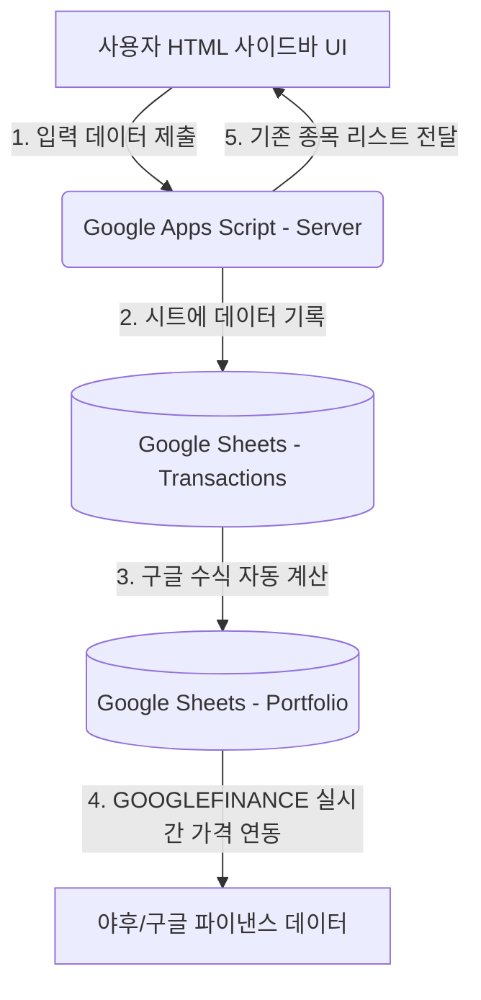

# 📈 Stock Investment Logger (Google Sheets & Apps Script App) - PRD & Tech Design
> **Author:** 20-Year Senior Web Developer  
> **Status:** Draft (Ready for Review)  
> **Date:** 2026-05-28  

---

## 1. 개요 (Overview)
본 프로젝트는 개인이 투자하는 국내/해외 주식 거래 내역을 기록하고, 실시간(또는 지연) 주가를 기반으로 자산 현황과 수익률을 자동으로 추적하는 **구글 스프레드시트 기반의 주식 기록 및 포트폴리오 관리 웹 애플리케이션**입니다. 

사용자가 복잡한 구글 시트 셀을 직접 편집하지 않고도, **구글 시트 내에 내장된 모던 HTML 입력창(Sidebar/Modal)**을 통해 쉽고 정확하게 거래(매수/매도) 내역을 입력하고, 입력과 동시에 예상 거래 금액 및 현재 포트폴리오 수익 현황을 직관적으로 확인할 수 있도록 개발합니다.

---

## 2. 제품 요구사항 정의 (PRD)

### 2.1. 핵심 기능 요구사항
1. **거래 내역 기록 (Transaction Logging)**
   - **종목 정보**: 종목명 및 종목코드(티커) 입력.
   - **거래 정보**: 거래 날짜/시간, 거래 구분(매수/매도), 수량, 단가 입력.
   - **투자 이유 기록**: 매매 결정을 내린 이유(아이디어, 시장 상황 등) 서술형 입력.
2. **실시간 주가 조회 및 수익률 계산**
   - 등록된 종목코드의 현재가를 조회하여 **실시간 평가 금액, 평가 손익, 수익률(ROI)**을 자동 계산.
   - 구글 시트 내의 `=GOOGLEFINANCE()` 함수와 외부 API 백업을 결합하여 안정적으로 가격 데이터 확보.
3. **사용자 친화적 입력 UI (Google Sheets HTML Sidebar)**
   - 구글 시트 내 메뉴(Custom Menu)를 클릭하면 우측에 세련된 디자인의 입력 사이드바가 노출됨.
   - **실시간 계산**: 수량과 단가를 입력하면 총 거래 금액이 화면에 즉시 계산되어 표시됨.
   - **자동 완성/기존 종목 선택**: 이전에 입력한 종목 리스트를 불러와 종목코드 입력을 편리하게 도움.
   - **입력 유효성 검사**: 필수값 누락 방지, 수량/단가 양수 검증, 올바른 날짜 포맷 검증.

### 2.2. 사용자 시나리오 (User Scenario)
1. **투자 결심 및 매수**: 투자자는 주식 A를 매수하기로 결정하고 앱을 켬.
2. **입력창 오픈**: 구글 시트 상단 메뉴 `[주식 관리] -> [거래 기록 입력]` 선택.
3. **정보 입력**: 사이드바에 종목명, 종목코드, 수량, 매수단가, 날짜를 입력하고, 매수 이유("실적 개선 전망 및 20일선 지지 확인")를 작성함.
4. **확인 및 저장**: '저장하기' 버튼을 누르면 구글 시트의 `거래내역` 시트에 행이 추가되고, `자산현황` 시트에 수익률이 즉시 갱신됨.
5. **수익률 모니터링**: 시트 메인 화면에서 실시간 주가 반영으로 변하는 내 자산 현황과 수익률을 모니터링함.

---

## 3. 데이터베이스 (구글 시트 구조) 설계

스프레드시트는 크게 두 개의 시트로 구성됩니다.

### 3.1. 거래내역 (`Transactions`) 시트
모든 매수/매도 거래가 시간 순서대로 누적되는 원천 데이터 시트입니다.

| 열 (Column) | 항목명 (Field) | 데이터 타입 | 설명/수식 |
| :--- | :--- | :--- | :--- |
| **A** | 거래 ID | String | 자동 생성 고유 ID (예: `TX-10001`) |
| **B** | 날짜 | Date | 거래 날짜 (YYYY-MM-DD) |
| **C** | 종목명 | String | 주식 종목 이름 (예: 삼성전자, Apple) |
| **D** | 종목코드 | String | 주식 티커/코드 (예: `005930`, `AAPL`) |
| **E** | 구분 | Enum | `매수` 또는 `매도` |
| **F** | 수량 | Number | 거래 주식 수 |
| **G** | 단가 | Currency | 1주당 거래 가격 |
| **H** | 거래금액 | Currency | 수식: `=E2 * F2` (수량 * 단가) |
| **I** | 매매 이유 | String | 해당 매매를 수행한 전략적 이유 |

### 3.2. 자산현황 (`Portfolio`) 시트
거래내역을 기반으로 종목별 평균 단가, 보유 수량, 현재가, 평가 손익을 요약하여 보여주는 시트입니다. 
구글 시트 수식을 적용해 **실시간 자동 갱신**되도록 구성합니다.

| 열 | 항목명 | 수식 / 설명 |
| :--- | :--- | :--- |
| **A** | 종목코드 | `=UNIQUE(FILTER(Transactions!D2:D, Transactions!D2:D<>""))` (고유 종목코드 추출) |
| **B** | 종목명 | `=XLOOKUP(A2, Transactions!D:D, Transactions!C:C)` (종목코드 매칭 종목명) |
| **C** | 보유수량 | `=SUMIFS(Transactions!F:F, Transactions!D:D, A2, Transactions!E:E, "매수") - SUMIFS(Transactions!F:F, Transactions!D:D, A2, Transactions!E:E, "매도")` |
| **D** | 평균매수단가 | `=SUMIFS(Transactions!H:H, Transactions!D:D, A2, Transactions!E:E, "매수") / SUMIFS(Transactions!F:F, Transactions!D:D, A2, Transactions!E:E, "매수")` (실제 투입된 평균 매수 비용) |
| **E** | 총 매수금액 | `=C2 * D2` (현재 보유한 수량에 대한 총 투자 원금) |
| **F** | 현재가 | `=GOOGLEFINANCE(A2, "price")` *(주1 참조)* |
| **G** | 평가금액 | `=C2 * F2` (보유수량 * 현재가) |
| **H** | 평가손익 | `=G2 - E2` (평가금액 - 총 매수금액) |
| **I** | 수익률 | `=IF(E2=0, 0, H2 / E2)` (퍼센트 형식 지정 `0.00%`) |

> **주1) GOOGLEFINANCE 사용 팁 및 제한 사항**
> * **미국 주식**: 티커 입력만으로 실시간 가격을 가져옵니다. (예: `AAPL`, `TSLA`)
> * **한국 주식**: 거래소 접두사를 붙여야 안전합니다. (예: 삼성전자는 `KRX:005930`, 카카오는 `KRX:035720`)
>   - 시트 입력 시 국내 주식은 앞에 `KRX:`를 붙여서 기록하거나, 현재가 수식에서 `=GOOGLEFINANCE("KRX:"&A2, "price")` 형식을 취할 수 있습니다.
> * **지연 시간**: GOOGLEFINANCE의 데이터는 최대 20분 정도 지연될 수 있습니다.

---

## 4. 기술 아키텍처 및 구현 방식

구글 스프레드시트는 단순한 스프레드시트가 아닌 **서버리스 백엔드(Apps Script)와 프론트엔드(HTML/CSS/JS)**를 탑재할 수 있는 강력한 플랫폼입니다.



### 4.1. 실시간 주가 연동 방법론
구글 스프레드시트에서 실시간 주가 및 수익률을 가져오는 방법은 3가지가 있으며, 당사의 솔루션은 **방법 1을 메인으로 사용하고 방법 2를 입력창 실시간 확인용 보조 수단으로 제안**합니다.

1. **방법 1: 구글 시트 내장 수식 (`GOOGLEFINANCE`) - [권장 및 기본값]**
   - **장점**: Apps Script 코딩 없이 실시간 연동되며 부하가 전혀 없음. 시트가 열려있는 동안 자동으로 시세 변동 반영.
   - **적용**: `Portfolio` 시트의 현재가(F열)에 수식 탑재.
2. **방법 2: Apps Script 외부 API 호출 (`UrlFetchApp`)**
   - **장점**: 입력 UI 창 자체에서 현재가와 예상 수익률을 저장 전에 미리 볼 수 있음.
   - **적용**: 사이드바 HTML에서 종목코드를 입력하고 "현재가 조회" 클릭 시, Apps Script가 Yahoo Finance나 Naver Finance 크롤링/API를 통해 가격을 가져와 HTML UI에 노출.

---

## 5. Google Apps Script 코드 (`Code.gs`)
구글 스프레드시트의 확장 프로그램 -> Apps Script 편집기에 붙여넣을 서버사이드 코드입니다.

```javascript
/**
 * 구글 스프레드시트가 열릴 때 실행되는 트리거 함수
 * 상단 툴바에 사용자 정의 메뉴를 생성합니다.
 */
function onOpen() {
  SpreadsheetApp.getUi()
    .createMenu('📈 주식 관리')
    .addItem('거래 기록 입력창 열기', 'showSidebar')
    .addItem('시트 초기 템플릿 구성', 'setupSheetTemplates')
    .addToUi();
}

/**
 * HTML 사이드바 UI를 화면 우측에 표시합니다.
 */
function showSidebar() {
  var html = HtmlService.createTemplateFromFile('Index')
    .evaluate()
    .setTitle('주식 거래 입력기')
    .setWidth(350);
  SpreadsheetApp.getUi().showSidebar(html);
}

/**
 * 초기 스프레드시트 구조(시트 생성 및 헤더 설정)를 세팅합니다.
 */
function setupSheetTemplates() {
  var ss = SpreadsheetApp.getActiveSpreadsheet();
  
  // 1. Transactions 시트 세팅
  var txSheet = ss.getSheetByName('Transactions');
  if (!txSheet) {
    txSheet = ss.insertSheet('Transactions');
  }
  txSheet.clear();
  var txHeaders = [['거래 ID', '날짜', '종목명', '종목코드', '구분', '수량', '단가', '거래금액', '매매 이유']];
  txSheet.getRange(1, 1, 1, 9).setValues(txHeaders)
         .setBackground('#2E3B4E').setFontColor('#FFFFFF').setFontWeight('bold').setHorizontalAlignment('center');
  txSheet.setFrozenRows(1);
  
  // 거래금액 자동 계산 수식 설정 (샘플 행)
  txSheet.getRange('H2').setFormula('=F2*G2');

  // 2. Portfolio 시트 세팅
  var portSheet = ss.getSheetByName('Portfolio');
  if (!portSheet) {
    portSheet = ss.insertSheet('Portfolio');
  }
  portSheet.clear();
  var portHeaders = [['종목코드', '종목명', '보유수량', '평균매수단가', '총 매수금액', '현재가', '평가금액', '평가손익', '수익률']];
  portSheet.getRange(1, 1, 1, 9).setValues(portHeaders)
           .setBackground('#1C2D42').setFontColor('#FFFFFF').setFontWeight('bold').setHorizontalAlignment('center');
  portSheet.setFrozenRows(1);

  // Portfolio 수식 자동 완성 세팅 (100행까지 자동 매핑 설정)
  // UNIQUE 함수로 고유 코드 추출
  portSheet.getRange('A2').setFormula(`=UNIQUE(FILTER(Transactions!D2:D, Transactions!D2:D<>""))`);
  
  // 나머지 열에 대한 수식 배치
  portSheet.getRange('B2:B100').setFormula(`=IF(ISBLANK(A2), "", XLOOKUP(A2, Transactions!D:D, Transactions!C:C))`);
  portSheet.getRange('C2:C100').setFormula(`=IF(ISBLANK(A2), "", SUMIFS(Transactions!F:F, Transactions!D:D, A2, Transactions!E:E, "매수") - SUMIFS(Transactions!F:F, Transactions!D:D, A2, Transactions!E:E, "매도"))`);
  portSheet.getRange('D2:D100').setFormula(`=IF(ISBLANK(A2), "", IFERROR(SUMIFS(Transactions!H:H, Transactions!D:D, A2, Transactions!E:E, "매수") / SUMIFS(Transactions!F:F, Transactions!D:D, A2, Transactions!E:E, "매수"), 0))`);
  portSheet.getRange('E2:E100').setFormula(`=IF(ISBLANK(A2), "", C2*D2)`);
  
  // 현재가 수식: 한국 주식(숫자 6자리)은 네이버 실시간 API 커스텀 함수(NAVERPRICE)를 사용하고, 해외 주식은 GOOGLEFINANCE 사용
  portSheet.getRange('F2:F100').setFormula(`=IF(ISBLANK(A2), "", IF(ISNUMBER(VALUE(A2)), NAVERPRICE(A2), GOOGLEFINANCE(A2, "price")))`);
  
  portSheet.getRange('G2:G100').setFormula(`=IF(ISBLANK(A2), "", C2*F2)`);
  portSheet.getRange('H2:H100').setFormula(`=IF(ISBLANK(A2), "", G2-E2)`);
  portSheet.getRange('I2:I100').setFormula(`=IF(ISBLANK(A2), "", IFERROR(H2/E2, 0))`);

  // 서식 지정
  portSheet.getRange('I2:I100').setNumberFormat('0.00%');
  
  SpreadsheetApp.getUi().alert('초기 템플릿 설정이 완료되었습니다! "Transactions"와 "Portfolio" 시트가 생성되었습니다.');
}

/**
 * HTML UI에서 전달받은 새로운 거래 내역을 Transactions 시트에 추가합니다.
 * @param {Object} data - 거래 정보 데이터 객체
 */
function addTransaction(data) {
  var ss = SpreadsheetApp.getActiveSpreadsheet();
  var sheet = ss.getSheetByName('Transactions');
  if (!sheet) {
    throw new Error('Transactions 시트를 찾을 수 없습니다. 상단 메뉴에서 초기 설정을 먼저 진행해주세요.');
  }

  // 거래 ID 생성 (현재 행 번호를 기반으로 유니크 ID 부여)
  var lastRow = sheet.getLastRow();
  var nextRow = lastRow + 1;
  var txId = 'TX-' + (10000 + nextRow);

  // 단가 및 수량 포맷 변환
  var qty = parseFloat(data.quantity);
  var price = parseFloat(data.price);
  
  // 새 거래 기록 작성
  var rowData = [
    txId,
    data.date,
    data.stockName,
    data.stockCode,
    data.type,      // 매수 or 매도
    qty,
    price,
    `=F${nextRow}*G${nextRow}`, // 거래금액 수식 자동 입력
    data.reason
  ];

  sheet.appendRow(rowData);
  return { success: true, txId: txId };
}

/**
 * 입력 편의성을 위해 기존 거래내역에 등록된 종목 리스트를 반환합니다.
 */
function getUniqueStocks() {
  var ss = SpreadsheetApp.getActiveSpreadsheet();
  var sheet = ss.getSheetByName('Transactions');
  if (!sheet) return [];

  var lastRow = sheet.getLastRow();
  if (lastRow < 2) return [];

  var range = sheet.getRange(2, 3, lastRow - 1, 2); // C열(종목명), D열(종목코드)
  var values = range.getValues();
  
  var uniqueMap = {};
  for (var i = 0; i < values.length; i++) {
    var name = values[i][0];
    var code = values[i][1];
    if (code && !uniqueMap[code]) {
      uniqueMap[code] = name;
    }
  }

  // 배열로 가공
  var result = [];
  for (var code in uniqueMap) {
    result.push({ code: code, name: uniqueMap[code] });
  }
  return result;
}

/**
 * 실시간 주가 사전 조회를 위한 외부 API 통신 함수
 * 한국 주식은 네이버 실시간 시세 API를 사용하고, 해외 주식은 Yahoo Finance API를 사용하여 가져옵니다.
 */
function fetchCurrentPrice(stockCode) {
  try {
    var codeStr = stockCode.toString().trim();
    
    // 1. 한국 주식 코드 판별 (숫자 6자리)
    if (/^\d{6}$/.test(codeStr)) {
      var url = "https://polling.finance.naver.com/api/realtime?query=SERVICE_ITEM:" + codeStr;
      var response = UrlFetchApp.fetch(url, { muteHttpExceptions: true });
      var json = JSON.parse(response.getContentText());
      if (json && json.result && json.result.areas && json.result.areas[0] && json.result.areas[0].datas && json.result.areas[0].datas[0]) {
        var price = json.result.areas[0].datas[0].nv; // nv: 현재가
        return { price: price, currency: 'KRW', success: true };
      }
    }
    
    // 2. 해외 주식 (Yahoo Finance API 호출)
    var ticker = codeStr;
    var url = 'https://query1.finance.yahoo.com/v8/finance/chart/' + ticker;
    var response = UrlFetchApp.fetch(url, { muteHttpExceptions: true });
    var json = JSON.parse(response.getContentText());
    
    if (json.chart && json.chart.result && json.chart.result[0]) {
      var meta = json.chart.result[0].meta;
      var price = meta.regularMarketPrice;
      var currency = meta.currency;
      return { price: price, currency: currency, success: true };
    }
    
    return { success: false, message: '주가 정보를 찾을 수 없습니다.' };
  } catch (e) {
    return { success: false, message: '에러 발생: ' + e.message };
  }
}

/**
 * 네이버 금융에서 한국 주식의 실시간 현재가를 가져오는 구글 시트 전용 사용자 정의 함수입니다.
 * 시트 셀에서 =NAVERPRICE("005930") 형태로 직접 호출할 수 있으며 실시간 주가를 제공합니다.
 * @param {string} stockCode 6자리 종목코드 (예: "005930")
 * @return {number} 현재가
 * @customfunction
 */
function NAVERPRICE(stockCode) {
  if (!stockCode) return "";
  var codeStr = stockCode.toString().trim();
  while (codeStr.length < 6 && /^\d+$/.test(codeStr)) {
    codeStr = "0" + codeStr; // 앞자리 0 자동 패딩
  }
  try {
    var url = "https://polling.finance.naver.com/api/realtime?query=SERVICE_ITEM:" + codeStr;
    var response = UrlFetchApp.fetch(url, { muteHttpExceptions: true });
    var json = JSON.parse(response.getContentText());
    if (json && json.result && json.result.areas && json.result.areas[0] && json.result.areas[0].datas && json.result.areas[0].datas[0]) {
      return json.result.areas[0].datas[0].nv;
    }
    return "N/A";
  } catch (e) {
    return "에러: " + e.message;
  }
}
```

---

## 6. HTML 입력창 UI 코드 (`Index.html`)
스프레드시트 내 사이드바 영역에 렌더링될 모던하고 감각적인 디자인의 웹 컴포넌트 코드입니다. 
고급스러운 **다크 테마**, **네온/그라데이션 효과** 및 **마이크로 인터랙션**을 적용하여 프리미엄 앱의 느낌을 줍니다.

```html
<!DOCTYPE html>
<html>
<head>
  <base target="_top">
  <!-- Google Font 로드 -->
  <link href="https://fonts.googleapis.com/css2?family=Outfit:wght@300;400;500;600;700&display=swap" rel="stylesheet">
  <style>
    :root {
      --bg-gradient: linear-gradient(135deg, #f0f7ff 0%, #e0e7ff 100%);
      --card-bg: rgba(255, 255, 255, 0.82);
      --border-color: rgba(99, 102, 241, 0.12);
      --text-main: #1e293b;
      --text-sub: #64748b;
      --accent-color: #4f46e5;
      --accent-glow: #6366f1;
      --success-color: #10b981;
      --danger-color: #ef4444;
    }

    * {
      box-sizing: border-box;
      font-family: 'Outfit', sans-serif;
      margin: 0;
      padding: 0;
    }

    body {
      background: var(--bg-gradient);
      color: var(--text-main);
      padding: 20px;
      min-height: 100vh;
      overflow-x: hidden;
    }

    /* 프리미엄 로고/헤더 */
    .header {
      margin-bottom: 24px;
      text-align: center;
    }

    .header h2 {
      font-size: 22px;
      font-weight: 700;
      letter-spacing: -0.5px;
      background: linear-gradient(to right, #4f46e5, #0ea5e9);
      -webkit-background-clip: text;
      -webkit-text-fill-color: transparent;
      margin-bottom: 4px;
    }

    .header p {
      font-size: 12px;
      color: var(--text-sub);
    }

    /* 모던 카드 레이아웃 */
    .card {
      background: var(--card-bg);
      backdrop-filter: blur(12px);
      -webkit-backdrop-filter: blur(12px);
      border: 1px solid var(--border-color);
      border-radius: 16px;
      padding: 20px;
      box-shadow: 0 10px 30px -5px rgba(99, 102, 241, 0.1);
      margin-bottom: 16px;
    }

    /* 폼 스타일링 */
    .form-group {
      margin-bottom: 16px;
      position: relative;
    }

    label {
      display: block;
      font-size: 11px;
      font-weight: 600;
      text-transform: uppercase;
      letter-spacing: 1px;
      color: var(--text-sub);
      margin-bottom: 6px;
    }

    input, select, textarea {
      width: 100%;
      background: rgba(255, 255, 255, 0.7);
      border: 1px solid #cbd5e1;
      border-radius: 8px;
      padding: 10px 12px;
      color: var(--text-main);
      font-size: 14px;
      transition: all 0.3s ease;
    }

    input:focus, select:focus, textarea:focus {
      outline: none;
      border-color: var(--accent-color);
      box-shadow: 0 0 0 3px rgba(99, 102, 241, 0.15);
      background: #ffffff;
    }

    /* 구분 매수/매도 토글 버튼 */
    .type-toggle {
      display: flex;
      gap: 10px;
      margin-bottom: 16px;
    }

    .toggle-btn {
      flex: 1;
      padding: 10px;
      border-radius: 8px;
      border: 1px solid #cbd5e1;
      background: rgba(255, 255, 255, 0.5);
      color: #64748b;
      cursor: pointer;
      font-weight: 600;
      text-align: center;
      transition: all 0.2s ease;
    }

    .toggle-btn.active.buy {
      background: #ecfdf5;
      border-color: var(--success-color);
      color: #047857;
      box-shadow: 0 4px 12px rgba(16, 185, 129, 0.12);
    }

    .toggle-btn.active.sell {
      background: #fef2f2;
      border-color: var(--danger-color);
      color: #b91c1c;
      box-shadow: 0 4px 12px rgba(239, 68, 68, 0.12);
    }

    /* 자동계산 거래 요약 대시보드 */
    .summary-box {
      background: rgba(99, 102, 241, 0.05);
      border-radius: 12px;
      padding: 14px;
      border-left: 4px solid var(--accent-color);
      margin-top: 12px;
      display: flex;
      flex-direction: column;
      gap: 6px;
    }

    .summary-row {
      display: flex;
      justify-content: space-between;
      font-size: 13px;
    }

    .summary-label {
      color: var(--text-sub);
    }

    .summary-val {
      font-weight: 600;
      color: var(--text-main);
    }

    .total-price {
      font-size: 16px;
      color: #4f46e5;
      font-weight: 700;
    }

    /* 버튼 스타일 */
    .btn-submit {
      width: 100%;
      background: linear-gradient(135deg, #4f46e5 0%, #3b82f6 100%);
      color: #ffffff;
      border: none;
      border-radius: 8px;
      padding: 12px;
      font-size: 15px;
      font-weight: 600;
      cursor: pointer;
      box-shadow: 0 4px 12px rgba(79, 70, 229, 0.25);
      transition: all 0.2s ease;
      margin-top: 8px;
    }

    .btn-submit:hover {
      transform: translateY(-2px);
      box-shadow: 0 6px 18px rgba(79, 70, 229, 0.35);
    }

    .btn-submit:active {
      transform: translateY(0);
    }

    /* 로딩 및 알림 */
    .loading-overlay {
      display: none;
      position: fixed;
      top: 0; left: 0; right: 0; bottom: 0;
      background: rgba(255, 255, 255, 0.85);
      z-index: 100;
      justify-content: center;
      align-items: center;
      flex-direction: column;
      gap: 12px;
      border-radius: 12px;
    }

    .spinner {
      width: 40px;
      height: 40px;
      border: 4px solid rgba(0, 0, 0, 0.05);
      border-top-color: var(--accent-color);
      border-radius: 50%;
      animation: spin 1s linear infinite;
    }

    @keyframes spin {
      to { transform: rotate(360deg); }
    }

    .toast {
      display: none;
      padding: 12px;
      border-radius: 8px;
      font-size: 13px;
      margin-bottom: 12px;
      text-align: center;
      animation: fadeIn 0.3s ease;
    }

    .toast.success {
      background: #ecfdf5;
      border: 1px solid var(--success-color);
      color: #047857;
      display: block;
    }

    .toast.error {
      background: #fef2f2;
      border: 1px solid var(--danger-color);
      color: #b91c1c;
      display: block;
    }

    @keyframes fadeIn {
      from { opacity: 0; transform: translateY(-5px); }
      to { opacity: 1; transform: translateY(0); }
    }

    /* 기존 종목 칩 디자인 */
    .stock-suggestions {
      display: flex;
      flex-wrap: wrap;
      gap: 6px;
      margin-top: 8px;
    }

    .stock-chip {
      background: rgba(79, 70, 229, 0.05);
      border: 1px solid rgba(79, 70, 229, 0.1);
      color: #4f46e5;
      padding: 4px 8px;
      border-radius: 20px;
      font-size: 11px;
      cursor: pointer;
      transition: all 0.2s;
    }

    .stock-chip:hover {
      background: rgba(79, 70, 229, 0.12);
      border-color: var(--accent-color);
      color: #312e81;
    }
  </style>
</head>
<body>

  <div class="header">
    <h2>STOCK PORTFOLIO</h2>
    <p>거래 내역 및 인사이트 기록기</p>
  </div>

  <div id="toastBox" class="toast" style="display:none;"></div>

  <div class="card">
    <!-- 매수/매도 토글 -->
    <label>거래 구분</label>
    <div class="type-toggle">
      <div id="btnBuy" class="toggle-btn active buy" onclick="setType('매수')">매수</div>
      <div id="btnSell" class="toggle-btn sell" onclick="setType('매도')">매도</div>
    </div>

    <!-- 폼 필드 -->
    <form id="txForm" onsubmit="submitForm(event)">
      <input type="hidden" id="txType" name="type" value="매수">

      <div class="form-group">
        <label for="date">거래 날짜</label>
        <input type="date" id="date" required>
      </div>

      <div class="form-group">
        <label for="stockCode">종목코드 / 티커</label>
        <div style="display: flex; gap: 8px;">
          <input type="text" id="stockCode" placeholder="예: AAPL 또는 005930" required onchange="onCodeChange()">
          <button type="button" class="toggle-btn" style="flex: 0 0 80px; font-size: 11px; padding: 0 8px;" onclick="checkCurrentPrice()">시세 조회</button>
        </div>
        <div id="suggestions" class="stock-suggestions">
          <!-- 기존 등록 종목이 여기에 로드됩니다 -->
        </div>
      </div>

      <div class="form-group">
        <label for="stockName">종목명</label>
        <input type="text" id="stockName" placeholder="종목명" required>
      </div>

      <div class="form-group" style="display: flex; gap: 10px;">
        <div style="flex: 1;">
          <label for="quantity">수량 (주)</label>
          <input type="number" id="quantity" step="any" placeholder="0" required oninput="calculateTotal()">
        </div>
        <div style="flex: 1.2;">
          <label for="price">거래 단가</label>
          <input type="number" id="price" step="any" placeholder="0" required oninput="calculateTotal()">
        </div>
      </div>

      <!-- 실시간 거래 요약 정보 -->
      <div class="summary-box">
        <div class="summary-row">
          <span class="summary-label">예상 거래 대금</span>
          <span id="lblTotal" class="summary-val total-price">0 원</span>
        </div>
        <div id="livePriceRow" class="summary-row" style="display: none; border-top: 1px dashed rgba(255,255,255,0.1); padding-top: 6px; margin-top: 4px;">
          <span class="summary-label">실시간 현재가</span>
          <span id="lblLivePrice" class="summary-val" style="color: #34d399;">-</span>
        </div>
      </div>

      <div class="form-group" style="margin-top: 16px;">
        <label for="reason">매매 이유 / 생각 기록</label>
        <textarea id="reason" rows="3" placeholder="왜 이 시점에 매수/매도했나요? 아이디어를 기록해보세요." required></textarea>
      </div>

      <button type="submit" class="btn-submit">거래 내역 등록</button>
    </form>
  </div>

  <!-- 로딩 오버레이 -->
  <div id="loading" class="loading-overlay">
    <div class="spinner"></div>
    <p style="font-size: 13px; color: var(--text-sub);">스프레드시트에 기록 중...</p>
  </div>

  <script>
    // 오늘 날짜 기본값 지정
    document.getElementById('date').value = new Date().toISOString().substring(0, 10);

    let currentType = '매수';
    let registeredStocks = [];

    // 실행 시 기존 등록된 종목 리스트 불러오기 (자동완성용)
    window.onload = function() {
      google.script.run
        .withSuccessHandler(function(stocks) {
          registeredStocks = stocks;
          renderChips();
        })
        .getUniqueStocks();
    };

    function setType(type) {
      currentType = type;
      document.getElementById('txType').value = type;
      
      const btnBuy = document.getElementById('btnBuy');
      const btnSell = document.getElementById('btnSell');
      
      if (type === '매수') {
        btnBuy.classList.add('active');
        btnSell.classList.remove('active');
      } else {
        btnBuy.classList.remove('active');
        btnSell.classList.add('active');
      }
      calculateTotal();
    }

    // 종목 칩 생성
    function renderChips() {
      const container = document.getElementById('suggestions');
      container.innerHTML = '';
      
      // 최대 5개 노출
      const displayStocks = registeredStocks.slice(0, 5);
      displayStocks.forEach(stock => {
        const chip = document.createElement('span');
        chip.className = 'stock-chip';
        chip.innerText = `${stock.name} (${stock.code})`;
        chip.onclick = function() {
          document.getElementById('stockCode').value = stock.code;
          document.getElementById('stockName').value = stock.name;
          onCodeChange();
        };
        container.appendChild(chip);
      });
    }

    // 종목코드 입력 시 기존 매칭 종목명 자동 매핑
    function onCodeChange() {
      const codeInput = document.getElementById('stockCode').value.trim();
      const matched = registeredStocks.find(s => s.code.toLowerCase() === codeInput.toLowerCase());
      if (matched) {
        document.getElementById('stockName').value = matched.name;
      }
      checkCurrentPrice();
    }

    // 실시간 주가 조회
    function checkCurrentPrice() {
      const code = document.getElementById('stockCode').value.trim();
      if (!code) return;
      
      const livePriceRow = document.getElementById('livePriceRow');
      const lblLivePrice = document.getElementById('lblLivePrice');
      
      lblLivePrice.innerText = '조회 중...';
      livePriceRow.style.display = 'flex';
      
      google.script.run
        .withSuccessHandler(function(result) {
          if (result && result.success) {
            let priceFormatted = new Intl.NumberFormat().format(result.price);
            lblLivePrice.innerText = `${priceFormatted} (${result.currency})`;
            // 매수/매도 단가 자동 채우기 유도 가능 (선택적)
          } else {
            lblLivePrice.innerText = '조회 실패';
          }
        })
        .fetchCurrentPrice(code);
    }

    // 예상 거래 금액 실시간 계산
    function calculateTotal() {
      const qty = parseFloat(document.getElementById('quantity').value) || 0;
      const price = parseFloat(document.getElementById('price').value) || 0;
      const total = qty * price;
      
      const formattedTotal = new Intl.NumberFormat().format(total);
      
      // 원화/달러 구분
      const code = document.getElementById('stockCode').value.trim();
      let currencyUnit = '원';
      
      // 영문 티커(미국주식) 판별
      if (/^[a-zA-Z]/.test(code)) {
        currencyUnit = ' USD';
      }
      
      document.getElementById('lblTotal').innerText = `${formattedTotal} ${currencyUnit}`;
    }

    // 폼 전송
    function submitForm(event) {
      event.preventDefault();
      
      const loading = document.getElementById('loading');
      loading.style.display = 'flex';
      
      const data = {
        type: document.getElementById('txType').value,
        date: document.getElementById('date').value,
        stockCode: document.getElementById('stockCode').value.trim(),
        stockName: document.getElementById('stockName').value.trim(),
        quantity: document.getElementById('quantity').value,
        price: document.getElementById('price').value,
        reason: document.getElementById('reason').value
      };
      
      google.script.run
        .withSuccessHandler(function(response) {
          loading.style.display = 'none';
          if (response.success) {
            showToast('거래 내역이 기록되었습니다!', 'success');
            // 입력 폼 초기화 (종목명, 코드 등 일부 유지 가능하나 안전하게 리셋)
            document.getElementById('quantity').value = '';
            document.getElementById('price').value = '';
            document.getElementById('reason').value = '';
            document.getElementById('lblTotal').innerText = '0 원';
            document.getElementById('livePriceRow').style.display = 'none';
            
            // 등록 종목 최신화
            google.script.run
              .withSuccessHandler(function(stocks) {
                registeredStocks = stocks;
                renderChips();
              })
              .getUniqueStocks();
          }
        })
        .withFailureHandler(function(err) {
          loading.style.display = 'none';
          showToast('기록 실패: ' + err.message, 'error');
        })
        .addTransaction(data);
    }

    function showToast(message, type) {
      const toast = document.getElementById('toastBox');
      toast.className = `toast ${type}`;
      toast.innerText = message;
      toast.style.display = 'block';
      
      setTimeout(function() {
        toast.style.display = 'none';
      }, 4000);
    }
  </script>
</body>
</html>
```

---

## 7. 기대 효과 및 활용 팁

### 7.1. 시각적 주가 모니터링 극대화
* **구글 스프레드시트 조건부 서식 (Conditional Formatting)**:
  - `Portfolio` 시트의 수익률(I열) 및 평가손익(H열) 범위에 조건부 서식을 지정합니다.
  - 값이 `> 0`이면 밝은 빨강(또는 초록 - 국가별 선호도 대응) 글자색/배경색, `< 0`이면 파랑/남색 계열 글자색/배경색이 지정되도록 설정하여 전체 자산 현황을 한눈에 식별할 수 있습니다.
* **차트(Dashboard) 구성**:
  - `Portfolio` 시트의 데이터를 이용해 **원형 차트(보유 종목 비중)**와 **누적 막대 차트(투자 원금 대비 평가 금액)**를 시트에 삽입하여 직관적인 자산 배분 비주얼을 구축할 수 있습니다.

### 7.2. 20년차 개발자의 설계 포인트
* **데이터 분리**: 단순 입력 시트(`Transactions`)와 비즈니스 연산 시트(`Portfolio`)를 명확히 나눔으로써 무한히 확장 가능하고 원천 데이터를 보존하는 안정적인 구조를 가져갑니다.
* **유연한 주가 연동**: 구글 서버가 불안정하거나 지연이 있을 경우를 위해 Apps Script 내에 크롤링/야후 파이낸스 API 백업 루틴(`fetchCurrentPrice`)을 내장하여 입력 인터페이스의 상호작용 신뢰성을 확보했습니다.
* **사용자 경험(UX) 극대화**: 다크 플랫 테마와 투명한 유광(Glassmorphism) 효과를 접목해 구글 기본 시트의 경직된 느낌을 배제하고, 마치 전용 핀테크 MTS 앱을 쓰는 듯한 몰입감을 선사합니다.

---

## 8. 향후 고도화 로드맵
1. **소수점 주식 및 수수료/세금 지원**: 수수료 및 세금 컬럼을 Transactions에 추가하여 보다 정확한 순수익 계산 제공.
2. **환율 변동성 반영 (Multi-currency)**: 미국 달러(USD) 거래에 대해 거래일 기준 또는 실시간 기준 환율을 계산하여 원화 통합 자산 현황 산출.
3. **포트폴리오 주기적 스냅샷**: 매일 자정에 총자산 평가액을 기록해 주는 트리거를 추가하여 **일별 자산 성장 그래프** 시각화.
